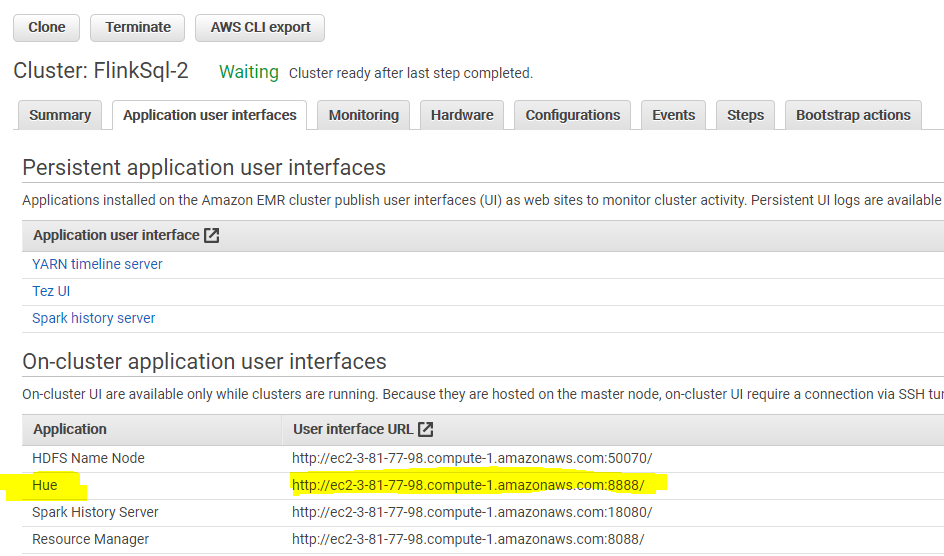

# FlinkSql with EMR/Hue

1. **Launch EMR Cluster with Flink and Hue** 


1. SSH into master node of the EMR cluster


2. **Start Flink Cluster as Yarn application:**

```
`flink-yarn-session -n 2 -s 4 -tm 16GB -d`
```

**Optional Start Flink in Standalone Mode:**

`cd /usr/lib/flink/`
`sudo ./bin/start-cluster.sh`


3. **Install Flink Gateway Server**

sudo yum install git -y
export FLINK_HOME=/usr/lib/flink

wget https://github.com/ververica/flink-sql-gateway/archive/refs/tags/flink-1.12.0.tar.gz
tar xvf flink-1.12.0.tar.gz
cd flink-sql-gateway-flink-1.12.0
sudo yum install maven -y
sudo mvn install
mkdir lib
cp target/flink*.jar lib/
bin/sql-gateway.sh

4. **Edit Hue.ini and update the notebook and interpreters sections:** 

```
sudo /etc/hue/conf/hue.ini
```

```
[notebook]
enable_notebook_2=true

# One entry for each type of snippet.
  [[interpreters]]
    # Define the name and how to connect and execute the language.
    # https://docs.gethue.com/administrator/configuration/editor/
    [[[flink]]]
     name=Flink
     interface=flink
     options='{"url": "http://127.0.0.1:8083"}'
```

5. **Restart Hue**

```
sudo systemctl stop hue
sudo systemctl start hue
sudo systemctl status hue
```

6. **Setup SSH Proxy and browser proxy to access the EMR UI links.**

Navigate to EMR Console Resource Manager. Click on the ApplicationMaster for the Flink Job under the Tracking UI:


Open Hue from EMR Console



You should see Flink listed as an editor in Hue.


     
Run a sample query:

``SELECT name, 
    COUNT(*) AS cnt 
  FROM (VALUES('Sam'),('Bob'),('Alice'),('Greg'),('Bob'),('Alice'),('Bob')) 
  AS NameTable(name) 
  GROUP BY name
``

**Create a Table using datagen connector to simulate streaming data:**

``CREATE TABLE orders (
order_id INT,
price DECIMAL(4,2),
buyer STRING,
order_time TIMESTAMP(3),
WATERMARK FOR order_time AS order_time - INTERVAL '5' SECOND)
WITH (
'connector' = 'datagen',
'rows-per-second'='500',
'fields.buyer.length'='3' )
``

**Run a streaming analytics query:**
`SELECT buyer, COUNT(buyer) AS buyer_count
FROM orders
GROUP BY TUMBLE(order_time, INTERVAL '10' second), buyer
HAVING COUNT(buyer) > 4;
`

You should see the jobs running on Flink Dashboard when submitted from Hue Flink Sql Interface. Results should appear under Hue Results’s tab:


